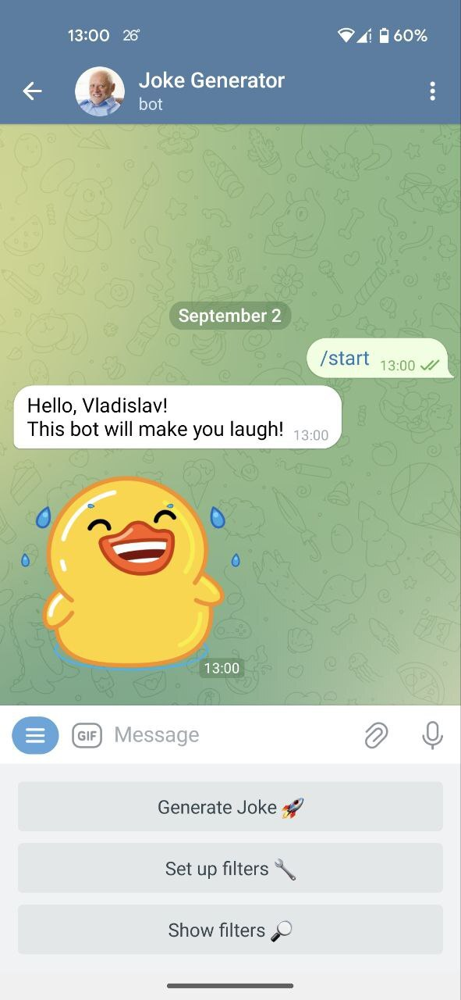
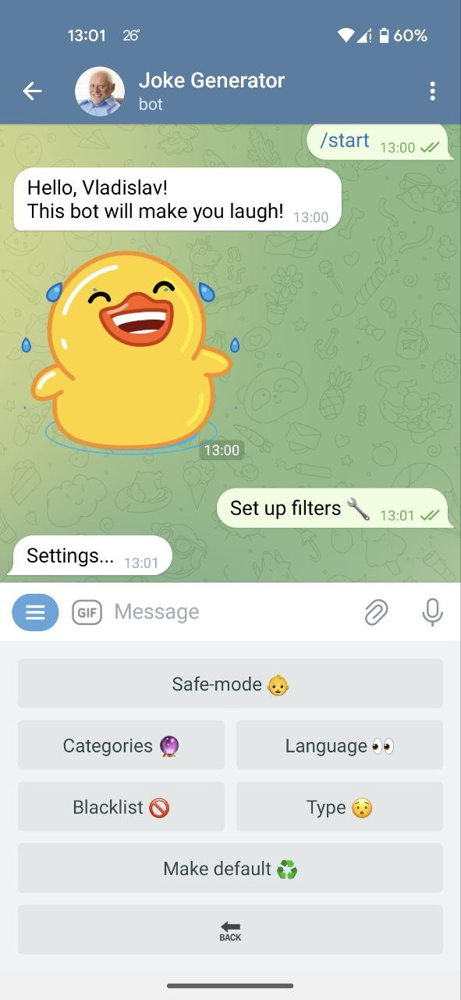
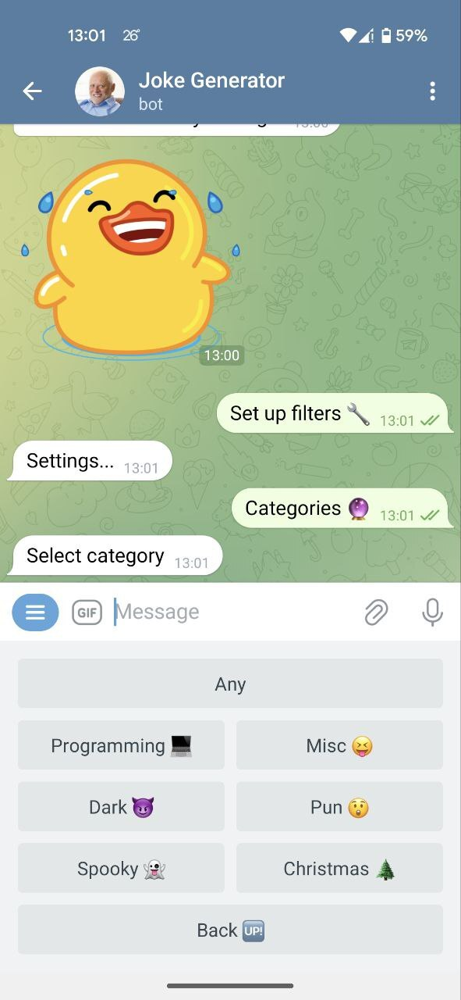
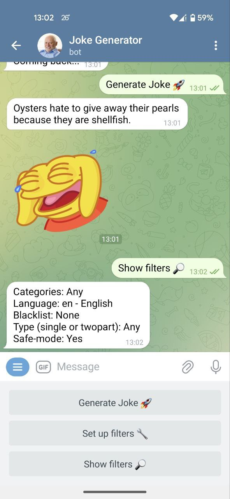

# Telegram Bot Joke Generator (C++)

This Telegram bot, written in C++, is designed to bring humor and laughter to your chats by delivering jokes and puns. It utilizes the [**tgbot-cpp**](https://github.com/reo7sp/tgbot-cpp) library for Telegram Bot API interaction, [**libcurl**](https://curl.se/libcurl/) for fetching jokes from an external source, and [**nlohmann/json**](https://github.com/nlohmann/json) for parsing the response.

The source of the jokes: [**Joke API**](https://sv443.net/jokeapi/v2/#info)

---
## Features

- You can set various filters (language, joke type, category, etc.).
- Several users can use the bot at the same time and their filters will not overlap.
- Console output of who is requesting what.

---
## Getting Started
To start service, simply use the `docker-compose up --build` command in your terminal (you may have to install docker and docker-compose).

But first you must create your own API token from [**Bot Father**](https://core.telegram.org/bots#how-do-i-create-a-bot) and put it in the .env file in the root directory of the project.

.env :
```
API_KEY=[...]
```

---
## Some screenshots


